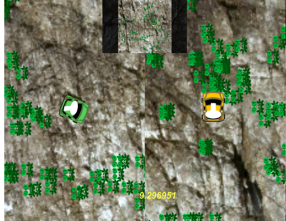
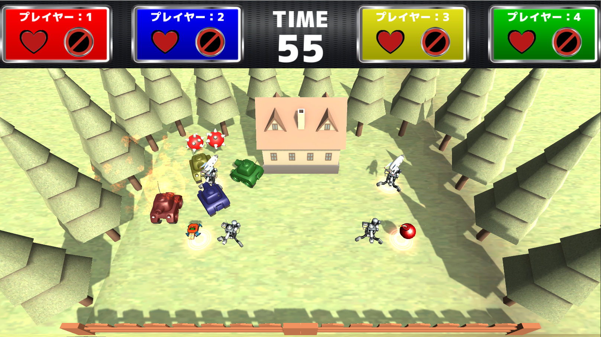

# my_game_examples
Some examples of the games I created

# 0.目録
- colorman
- walltank
それぞれの詳細は、フォルダ内を参照してください。

# 1.colorman紹介
## 1-a.ゲーム概要
- 車を操作し、種を発射して花を植える。
- 相手の花を踏むと、吸収して花を消すとともにパワーアップする。
- 最後に自分の色の花が多かった方が勝ち。
- コンセプトは以下。
 - - 対人攻撃なし
 - - 子供もかんたんに遊べて、ゲームになれた人同士でやっても白熱する。

 ゲーム画面サンプル：

 

## 1-b.開発期間
2015/5月ごろ～6月ごろ

## 1-c.メンバ構成と担当
メンバ：2人
- 自分
 - - 開発
- 他メンバ
 - - 進捗管理、設計アドバイス

## 1-d.開発の思い出
一番最初に、1つの作品として作ったゲーム。

進捗管理とアドバイスを先輩がしてくれて、開発を全部やってみようというスタンスであった。

動かして気持ちの良いことと、小さな子でも遊べることを追求したが、その上では以下が大変だった。

[problem 1] パワーアップが細かいタイミングであるため、バランス調整がむつかしい。
 - solution: 脳筋スタイルだが、自分でコントローラ２つ繋げて動かし、気持ちいいと思えるまで延々とパラメータ調整を行った。

[problem 2] 小さな子でも遊べるゲームにするのがむつかしい。
 - solution: 操作に必要なボタンを減らす、説明を充実させる、対人を意識せず自分のペースでも目的を達成できるようにする。

結果としては、学園祭で小さな子が面白いと言ってやってくれていたので、とても満足した。

## 1-e.成果物など
colormanディレクトリに、Scriptsのみを置きました。

# 2.walltank紹介
## 2-a.ゲーム概要
- 戦車を操作し、戦う
- 最後に残ったものが勝者
- 基本攻撃は砲撃
- アイテムを拾って使うこともできる
- ステージは3つ。ステージごとにギミックが存在
- 4人まで対戦可能。1人でもCPUが相手をしてくれる

 ゲーム画面サンプル：
 

## 2-b.開発期間
2016/6月ごろ～10月ごろ

## 2-c.メンバ構成と担当
メンバ：たしか4人
- 自分
 - - コントローラ入力からの戦車の移動および砲台の回転、CPUの移動や行動、アイテムのプログラム
- 他メンバ
 - - 基本設計、攻撃エフェクト、アイテムや攻撃のエフェクト、アイテムや攻撃のプログラム、ステージギミック　など

subversionにより、ソースコードを管理。

## 2-d.開発の思い出
アイテムやエフェクトのアイディアをどんどん出すメンバがいて、いつの間にかエフェクトなどが追加されており、それを物にしよう。といってプログラムを書くというサイクルがあったと記憶しており、それがとても楽しかった。

また、CPUの移動について担当していたが、これもいつの間にか実装しておいてメンバが気付く。ということを何度かしており、反応が楽しかった記憶がある。

しかし、１度それが裏目に出たことがある。損失を避ける消極的な設定のCPUを、弾を避けるのが極端にうまいように実装したところ、「弾と戦車の当たり判定がバグって、弾が戦車と当たってもダメージを受けず押し出されてしまう」というバグと思われて、メンバが悩んでしまっていた。

サプライズで機能を用意しておくのは楽しいが、限度はあるようだ。

## 2-e.成果物など
複数人で作成したため、ソースコードは限定公開とし、Asset類も削除した状態となります。

ご連絡いただけましたら、ファイル共有リンクをお送りいたします。